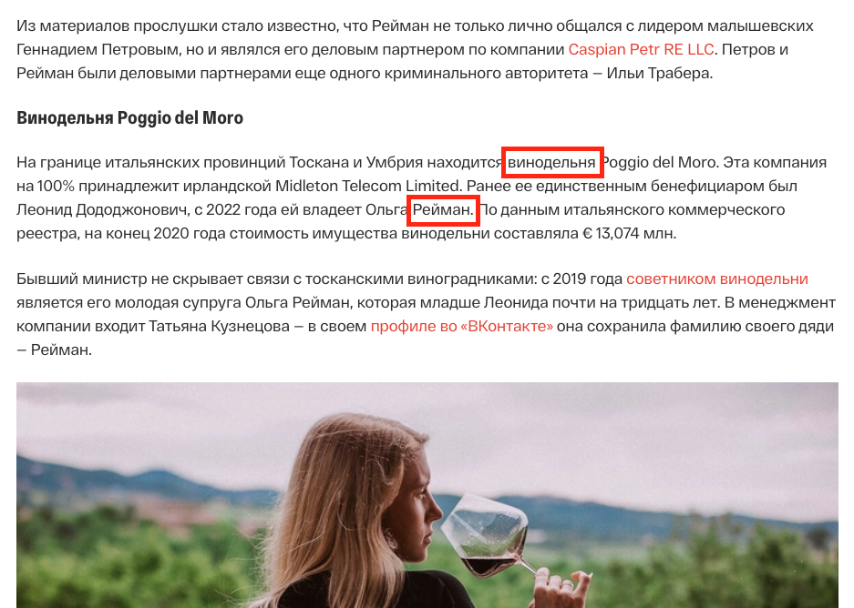
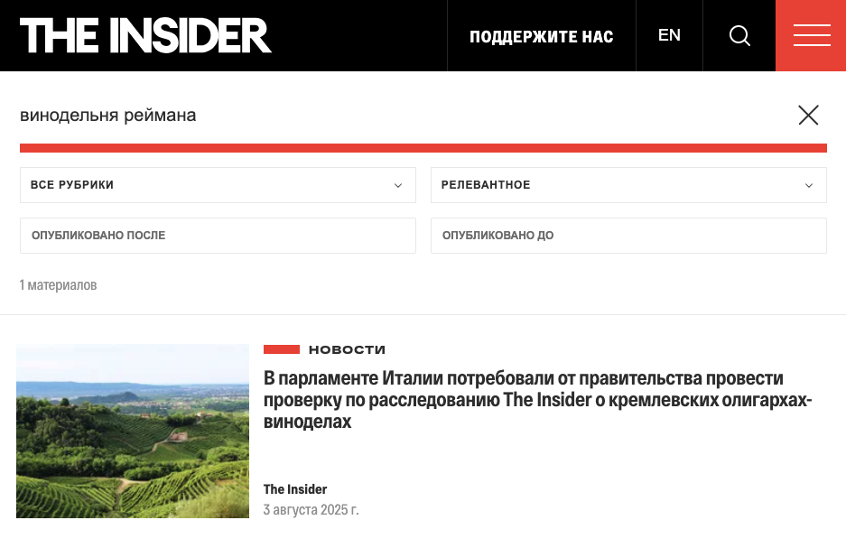

# AI-based search in the search bar for The Insider [prototype]

**GitHub Pages** 
Live Demo: https://anatolii-serzhantov.github.io/the-insider-ai-search-bar/

**Objective:** This project aims to enhance the search precision and context awareness on the website by implementing AI-powered semantic search. 
Project focuses on solving limitations of pure vector search by combining model´s semantic embeddings with optimized rule-based heuristics and proportional ranking algorithms.

**Model used:** `Xenova/paraphrase-multilingual-mpnet-base-v2` (quantized). The model maps the user's query to a 768-dimensional dense vector space and calculates the cosine similarity against pre-computed article vectors.

**Data preparation:** The underlying dataset includes 1590 articles from https://theinsider.ru, that were parced, cleaned and pre-vectorized using Python script.

Image 1. Search query "5th Service" ("5-я служба")

## Applied search optimization:

### 1. Negative topic penalties
Implemented penalty system to prevent the model from returning highly semantically related but factually incorrect results. Differentiation between the "1th Service", "2th Service" and "5th Service" was applied. If a user searches for the "5th Service" ("5-я служба"), but the article heavily discusses the "1st Service" and lacks the "5th", the algorithm applies -40% penalty, dropping the irrelevant cluster from the top results. 

### 2. Dynamic morphological expansion
To handle the variations in word endings in the Russian, the search engine expands numerical and entity queries into morphological synonym groups (e.g., `"5"` expands to `["5-я", "5-й", "пятая", "пятую", "пятой"]`).

### 3. Anti-false-positive regex
Keyword bonuses are protected by advanced Regular Expressions using Negative Lookbehinds `(?<![\d.,])`. This ensures that when the algorithm searches for a specific number (like the "2nd Service"), it ignores decimals (e.g., `2` in `3888.2 sq meters`), preventing corrupted relevance scores and false high search result position.

### 4. Proportional context boosting
Proportional boosting was implemented for queries about Alexey Navalny in which articles in the `/investigations` category receive a bonus. A highly relevant investigations about Navalny, which are among the outlet's key articles, are given priority in search results.

Image 2. Search query "Navalny" ("Навальный")

### 5. Article snippet extraction:
The engine splits articles into sentences, scores each sentence based on query/synonym density, and dynamically extracts the top 3 most relevant sentences. Matches are highlighted using safe Regex replacements.

## Examples of enhancing search results
1. In the article theins.ru/inv/283609 mentioned politician "Raiman" ("Рейман") in a context of owning a winery ("винодельня"). In the case of searching "Винодельня Реймана" ("Reiman Winery"). Actual The Insider´s search doesn´t suggest the link to associated investigation. While AI-based search demonstrates link to the original article by vector search.

Image 3. Mention of keywords in the original searched article

Image 4. Actual The Insider´s search doesn´t suggest link to the original article

Image 5. AI-based search shows the searched investigation in the 1st place in search results by vector search

## Roadmap
1. RAG - generation for article text preview with `DeepSeek-V4-Flash`.
2. Search corner cases discussion and implementation.
3. Implementation in the site's backend (client-side to server-side):
   - `Llama 3` or `Qwen 2.5` server deployment.
   - Vector storing database deployment `PostgreSQL` with `pgvector` 
